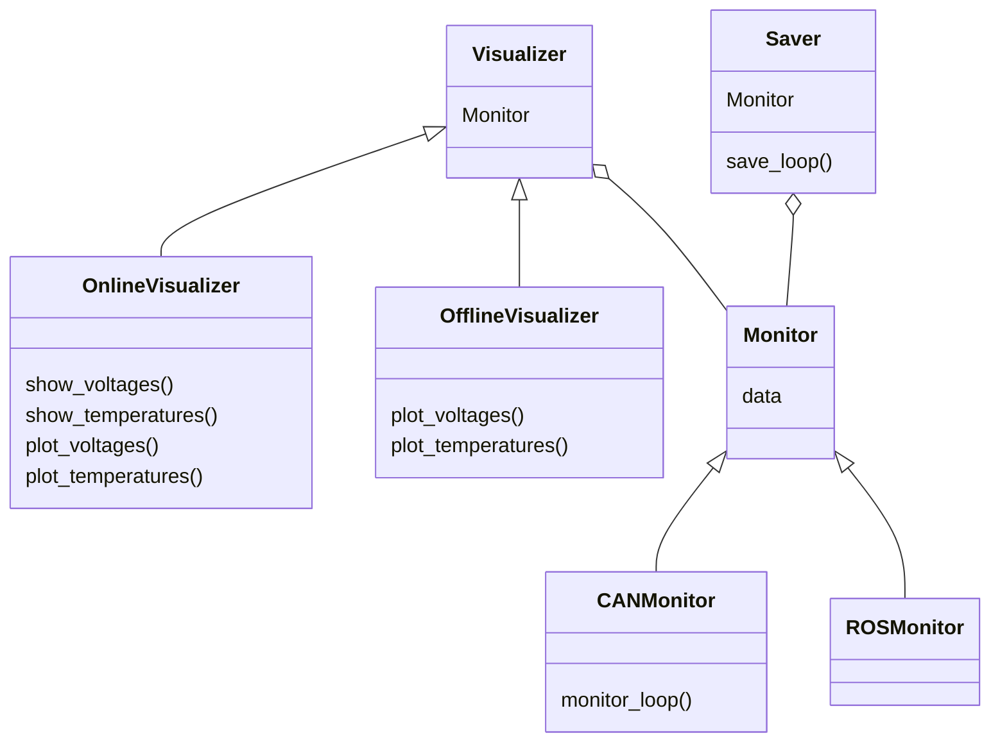

# Lithium

This is a simple program that reads data from the battery and visualizes it. It is based on the [Dash](https://dash.plotly.com/) framework.

1. [Usage](#usage)
2. [Software Architecture](#software-architecture)
3. [Pending Tasks](#pending-tasks)

## Usage

Run this program with `python main.py` and visit http://127.0.0.1:8050/ in your web browser.

## Software Architecture 

## Pending Tasks

- [ ] Create executable with [cx_Freeze](https://cx-freeze.readthedocs.io/en/stable/setup_script.html)